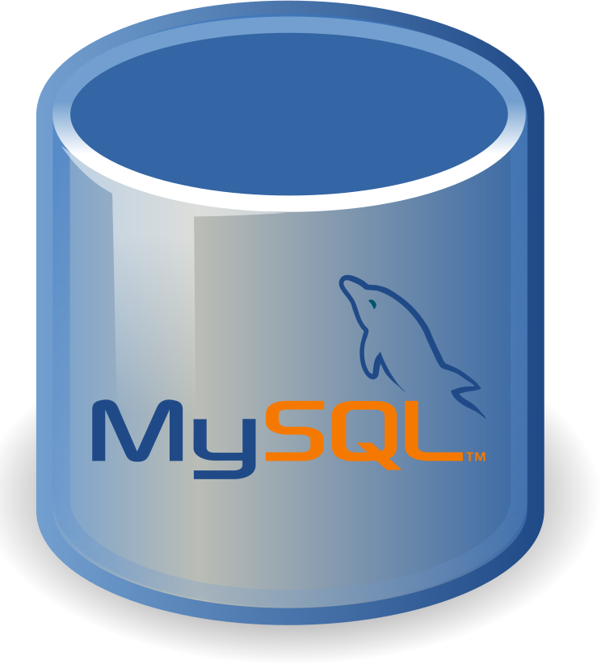

# Saudações, Colegas Devs! 🖖👾 #

* Técnico em Informática 💻
* Desenvolvedor de Software Back-End 👨‍💻
* Estudante da [Alura Cursos Online](https://github.com/alura-cursos) 📚🖥️
* Email para Contato: sandror.desouza847@gmail.com 📧
* Linkedin: https://www.linkedin.com/in/sandro-rosa-de-souza-02a5bb241/ 🤵

## Linguagens/Skills: ##

